# AgentX

我最近在公眾號「卡碼大模型」上，更新了很多關於 Agent、codex、Claude工作原理的文章。

這些文章目前已經沉澱在卡碼筆記上：[https://notes.agentxcoder.com](https://notes.agentxcoder.com)

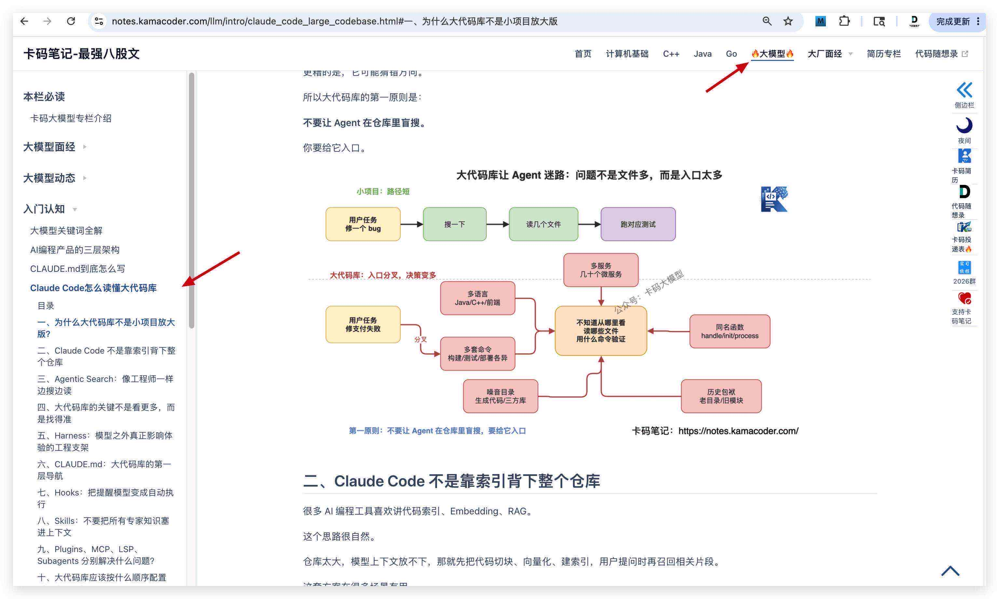

很多錄友反饋：

卡哥，我看了很多文章，也知道 Agent Loop、ReAct、Tool Use、MCP 這些詞，但總感覺隔了一層。

很多概念還停留在“知道名詞”的階段。

現在大家找工作。無論你是哪個方向，現在都需要有一個Agent專案。

Agent 這個東西，光看文章還不夠。

你得自己實現一個最小版本，親手把使用者輸入、拆解任務、loop、工具呼叫、事件流、許可權審批、上下文管理這些鏈路串起來，才會真正理解：

**所謂 AI Agent，到底是怎麼跑起來的。**

目前市面上，哪裡那個Agent做的最好，當然是Claude。

所以這次我在知識星球裡更新一個新的 AI Agent 專案：

**AgentX：從零實現一個本地 Claude Code Agent 系統（mini 版）。**

也可以理解為：我們自己動手實現一個 **minClaude**，不僅實現Agent核心，還是先一套 TUI。

大家可以看一下效果：（接入的是deepseek-v4-flash，當然大家也可以接入其他模型）。


可以接入命令，可以使用skill，可控制上下文，可壓縮：


可以下達一個稍稍負責的任務，AgentX自動完成規劃 並執行：

（AgentX會先申請一下本地編輯許可權）

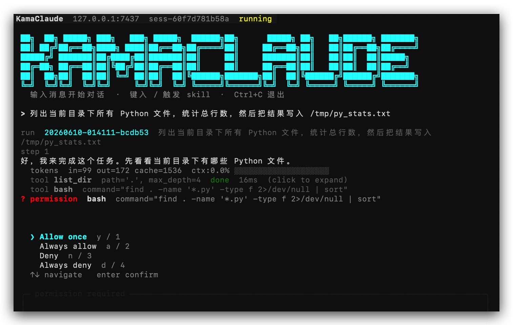

然後規劃並執行：


當然，它不是要一比一復刻 Claude Code 的所有產品能力，而是把 Claude Code 這類 AI 程式設計 Agent 最核心的執行機制拆出來：

* 使用者輸入一個目標，Agent 能自己規劃下一步
* 模型不是隻回答文字，而是能主動發起工具呼叫
* 工具呼叫不是直接裸跑，而是有引數校驗和許可權審批
* 執行過程不是黑盒，而是透過事件流即時展示到 TUI
* 每一次 run 都能留下 events、trace、session 記錄，方便覆盤和排查
* 多輪會話不是簡單拼接歷史，而是有 thread、notes、context 分層記憶
* 上下文快爆了，不是粗暴截斷，而是有水位檢測和 compact 壓縮
* 複雜任務可以交給子 Agent，外部工具可以透過 MCP 接進來

我們要做的是一個真正能跑任務、能調工具、能看過程、能管許可權、能續上下文、能擴充套件生態的本地 Agent 執行時。

你學完之後，再看 Claude Code、Codex、Cursor 這些 AI 程式設計工具，就不會只停留在“它好像很智慧”。

你能看懂它背後那條工程主線：

**使用者目標 → Agent Loop → 模型思考 → 工具呼叫 → 結果回填 → 事件展示 → 會話續航。**

### 專案演示

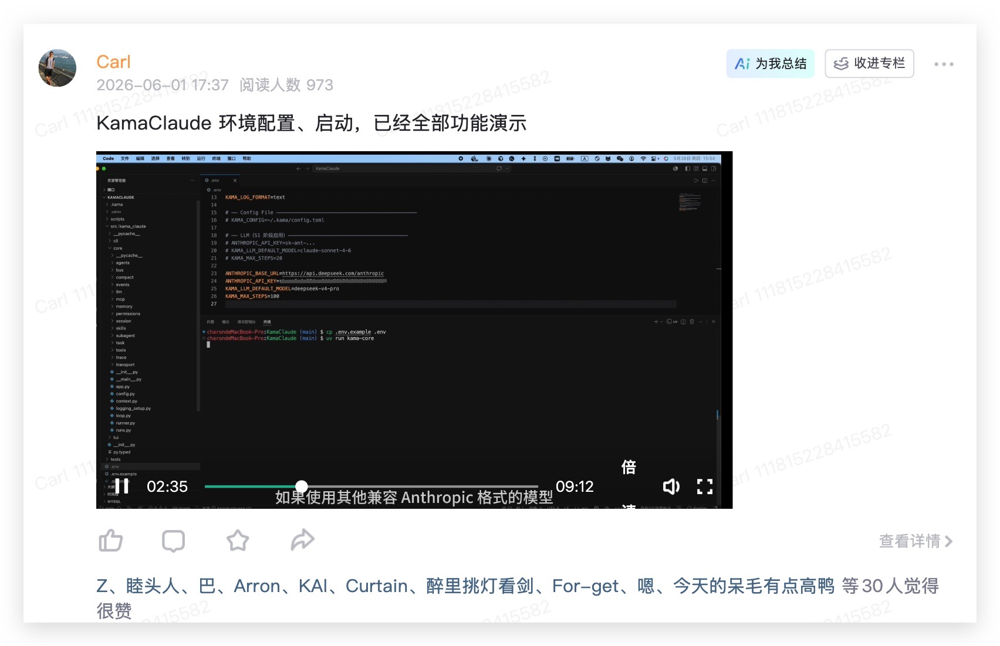

本影片只在[知識星球](https://programmercarl.com/other/kstar.html)裡，帶大家演示如何從零執行 AgentX，並完成一次完整的 Agent 使用體驗：

* 克隆專案和切換階段分支
* 配置 `.env`
* 讓 Agent 寫一個一個任務
* 配置 Skill 和 MCP
* 在 TUI 裡看到工具呼叫、事件流、許可權審批和上下文水位

### AgentX 長什麼樣？

AgentX 的最終形態是這樣的：

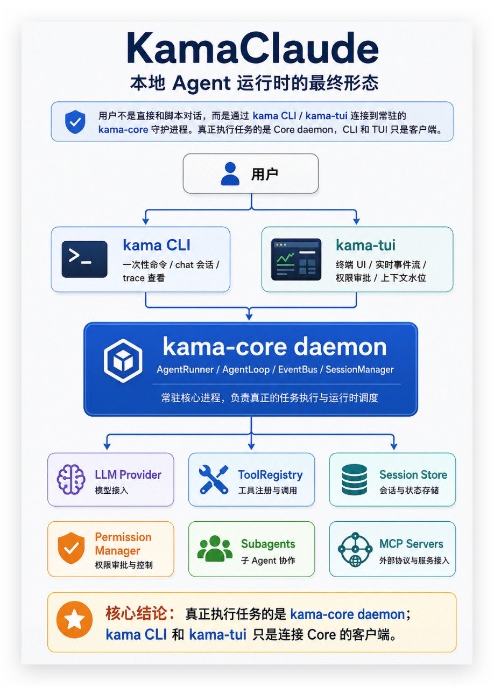

使用者不是直接和一個指令碼對話，而是透過 `agentx` CLI 或 `agentx-tui` 連線到常駐的 `agentx-core` 守護程式。

真正執行任務的是 Core daemon。

CLI 和 TUI 只是客戶端。

這意味著：

* TUI 崩了，Agent 任務不一定要跟著死
* 後續可以同時接 CLI、TUI、Web 前端
* 所有任務過程都能透過事件流訂閱
* 所有命令、響應、事件都要透過型別化協議通訊
* Agent 的工具呼叫、會話記憶、許可權審批、上下文壓縮，都在同一條執行鏈路裡完成

這就是它和普通 AI Demo 最大的區別：

**普通 Demo 是“呼叫模型”。AgentX 是“搭一個本地 Agent 執行時”。**

### 專案專欄目錄


從專案演示，執行到 專案實戰：架構如何設計、環境怎麼搭，Agent loop，上下文、可壓縮、MCP、skill支援這些如惡化設計。

最後再到求職相關：專案的簡歷寫法、專案亮點、本專案常見面試題，都給大家準備好了。

從**專案原始碼到答疑，一條龍服務，不用擔心學不會，有什麼問題都可以在專屬微信群提問**：（[知識星球](https://programmercarl.com/other/kstar.html)裡每個專案都有專屬答疑群）

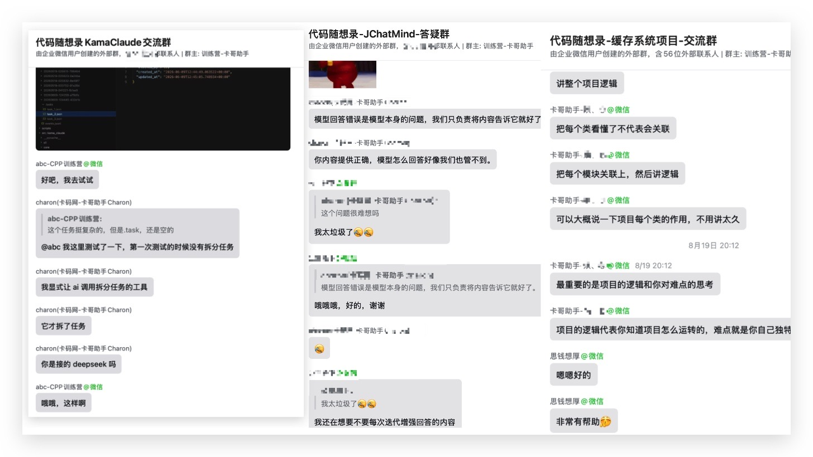

掃如下十元代金券，只需要 196 元，加入[知識星球](https://programmercarl.com/other/kstar.html)，你將獲得 **20+ 套專案教程專欄 + 原始碼 + 配套答疑**。

每個專案平均不到十元錢，而且加入星球的服務遠不止這些專案。

<div align="center"> </img></div>

加入知識星球后，記得加如下微信，發動付款截圖，拉你到星球交流群：

<div align="center"> </img></div>

如果你不知道知識星球對自己是否有幫助，可以先加入看看，感受一下星球裡的學習氛圍。

**三天內（72h）可以全額退款。**

### 專案特色

這個專案，我採用全新的講解方式，不是一下子直接給大家全部專案程式碼。

而且分成了 8個階段，一步一步，帶大家實現完整的agentxClaude。

每個階段都不是堆功能，而是解決一個真實的 Agent 工程問題。


| 階段 | 主題 | 這一階段真正解決的問題 |
| --- | --- | --- |
| S0 | 骨架與協議契約 | CLI 和 daemon 透過真實 IPC 完成一次 ping/pong |
| S1 | Agent 最小閉環 | 一次 `agentx run` 從 goal 到 LLM、工具、事件檔案完整跑通 |
| S2 | 事件流外化 | AgentRunner 搬進 daemon，CLI/TUI 透過 IPC 訂閱同一份事件流 |
| S3 | 自主規劃與 TUI | Agent 能用任務工具拆解複雜目標，TUI 展示完整執行過程 |
| Trace | 系統級時間線 | IPC / EventBus / LLM 三層資料流可追蹤、可回放 |
| S4 | 會話與記憶 | 多輪 run 進入同一個 session，thread 和 notes 接住上下文 |
| S5 | 工具安全 | 工具呼叫前有引數校驗、許可權審批、失敗分類和重試 |
| S6 | 上下文治理 | 長會話下有 context 水位、tool_result 截斷和 compact |
| S7 | 擴充套件邊界 | Skills、Subagents、MCP 讓 Agent 可組織、可派生、可接外部工具 |

從第一章開始，專案就不是“先寫一個指令碼，後面再慢慢重構”。

AgentX 在 S0 就先把 `agentx` CLI 和 `agentx-core` daemon 拆開，透過 TCP NDJSON + JSON-RPC 2.0 通訊。

這一步看起來比普通腳手架更重，但它換來的是後面所有能力都不用推倒重來：

* TUI 可以複用同一套 IPC
* 事件訂閱可以複用同一套通道
* 許可權審批可以透過事件推到前端
* trace 可以記錄完整請求和響應
* 後續 Web 前端也可以接入同一個 Core

這就是工程專案裡真正值錢的地方。

不是“能不能跑”，而是系統邊界一開始就立住。

### 專案架構圖


AgentX 的核心不是一個 prompt，而是一套完整的本地 Agent 執行鏈路：

```latex
使用者目標
  → CLI / TUI
  → JSON-RPC over NDJSON
  → agentx-core daemon
  → AgentRunner
  → AgentLoop
  → LLM Provider
  → ToolRegistry
  → PermissionManager
  → EventBus
  → Session Store
  → TUI 即時渲染 / events.jsonl 持久化 / trace 回放
```

你學完以後，面試官再問 AI Agent 專案，你就不是說：

“我呼叫了大模型 API。”

而是能說：

* 我實現了 ReAct AgentLoop 和工具呼叫閉環
* 我用 EventBus 把 Agent 執行過程外化成事件流
* 我實現了 TUI 即時渲染、工具摺疊塊、許可權審批卡片
* 我實現了 Session、thread、notes 三層記憶體系
* 我實現了上下文水位檢測、tool_result 截斷、自動 compact 和手動 compact
* 我實現了 Skills、Subagents、MCP 外部工具接入
* 我用 pytest、mypy strict、ruff 保證專案質量
* 我實現了守護程式 + 多客戶端架構
* 我設計了 JSON-RPC 2.0 + NDJSON 的型別化 IPC 協議

這就不是“AI 套殼專案”了。

這是一個能拿去講系統設計、非同步併發、協議建模、工具安全、上下文工程、多 Agent 編排的高質量專案。

### 專案亮點

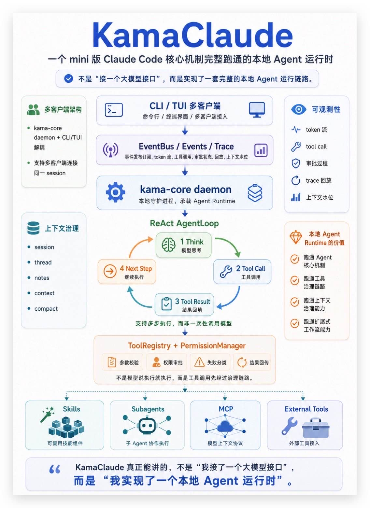

AgentX 最大的亮點，是把 Claude Code 這類 AI 程式設計 Agent 背後的核心機制，用一個 mini 版工程完整跑通：它不是單程式指令碼，而是 `agentx-core` daemon + CLI/TUI 多客戶端架構；

不是一次性調大模型，而是 ReAct AgentLoop，支援模型思考、工具呼叫、結果回填和多步執行；

不是讓模型說執行就執行，而是把工具呼叫放進 `ToolRegistry` 和 `PermissionManager`，先做引數校驗、許可權審批、失敗分類，再把 tool result 返回給模型；

不是隻展示最終答案，而是透過 `EventBus`、events、trace 和 TUI，把 token 流、工具呼叫、審批、上下文水位都即時展示並可回放；

不是簡單拼接聊天曆史，而是用 session、thread、notes、context 和 compact 做上下文治理；

最後還支援 Skills、Subagents、MCP，把工作流、子 Agent 和外部工具統一接進同一套執行鏈路。

也就是說，這個專案真正能講的不是“我接了一個大模型介面”，而是“我實現了一個本地 Agent 執行時”。


### 這個專案適合誰？

如果你正在準備秋招、春招、實習、社招，想做一個 AI 專案，想了解Agent工作原理，這個專案很適合你。

如果你已經做過 RAG、聊天機器人、AI 助手，想把專案深度往 Agent 工程方向拔高，這個專案也很適合。

如果你想理解 Claude Code、Codex、Cursor 這類 AI 程式設計工具背後的執行時設計，這個專案同樣值得系統學一遍。

它不是教你背概念。

**它是帶你從 S0 到 S7，八個階段，把一個本地 Agent 工具從零搭出來**。

每一章都有明確的執行路徑，每一階段都能執行、能驗證、能留下檔案證據。

你不是最後拿到一個黑盒專案。

你會知道它每一層為什麼存在。

### 專案專欄

**本專案為文字專欄講解方式，不過在專案環境配置，啟動，使用上 給大家錄製了影片**。

專案專欄把 簡歷寫法、專案亮點、常見面試題 都準備好了，大家做完這個專案可以直接用。


本專案分成8個階段完成，每一階段都有詳細講解：

S0、專案基礎架構：

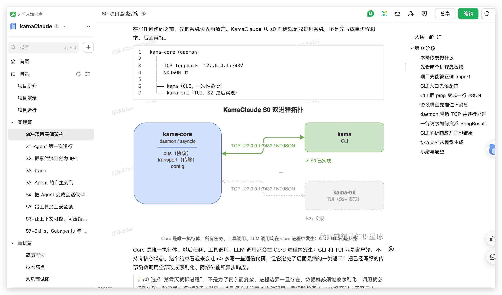

S1、Agent 第一次執行

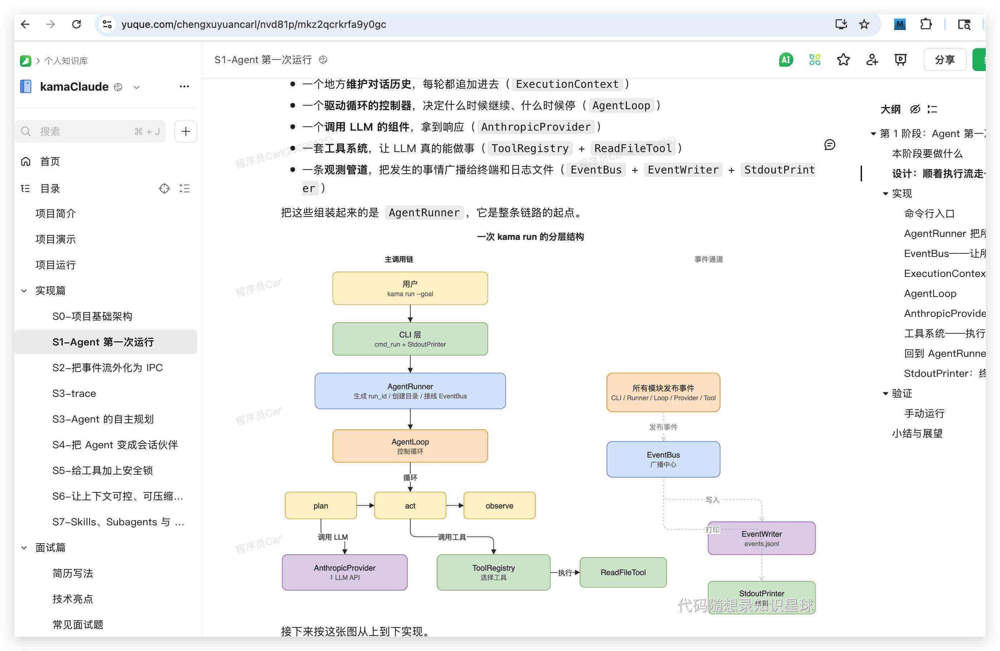

S2、把事件流外化為 IPC

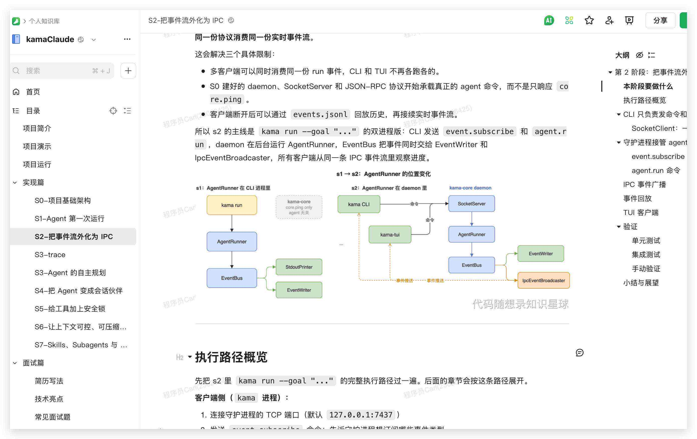

S3、trace

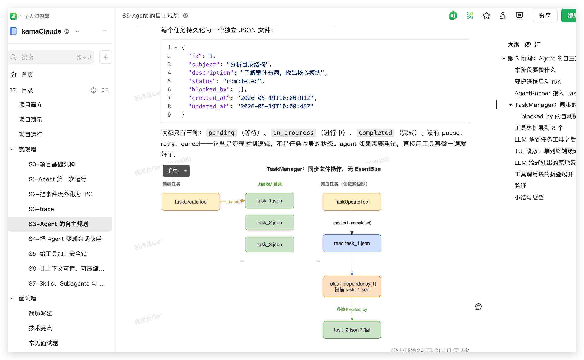

S3、Agent 的自主規劃


S4、把 Agent 變成會話夥伴

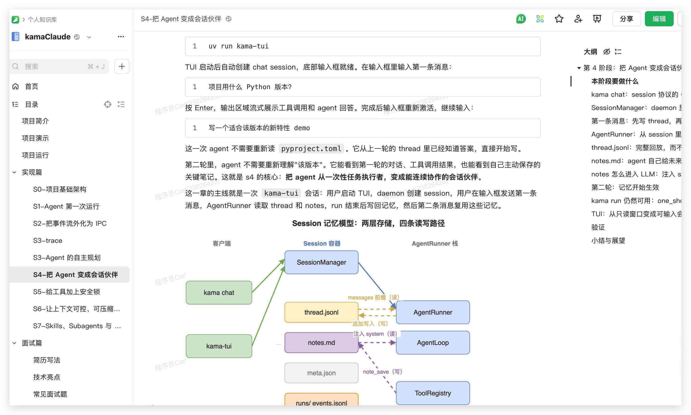

S5、給工具加上安全鎖


S6、讓上下文可控、可壓縮、可續航

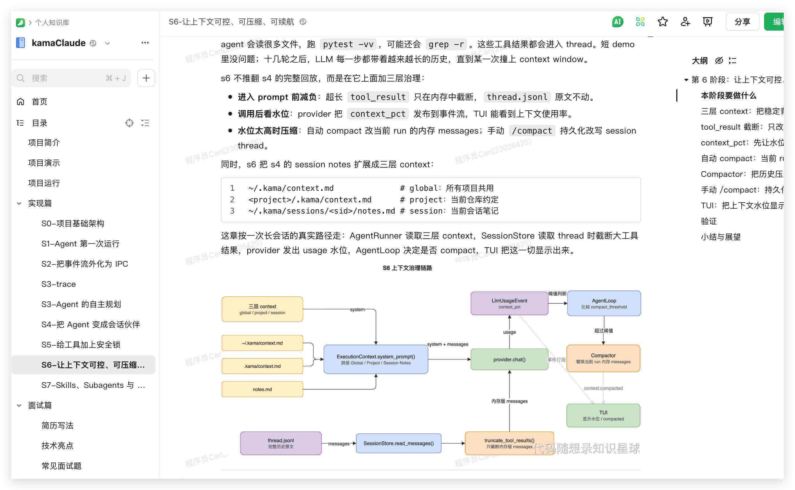

S7、Skills、Subagents 與 MCP


### 加入知識星球獲取本專案

掃如下十元代金券，只需要 196 元，加入[知識星球](https://programmercarl.com/other/kstar.html)，你將獲得 **20+ 套專案教程專欄 + 原始碼 + 配套答疑**。

每個專案平均不到十元錢，而且加入星球的服務遠不止這些專案。

<div align="center"> </img></div>

加入知識星球后，記得加如下微信，發動付款截圖，拉你到星球交流群：

<div align="center"> </img></div>


如果你不知道知識星球對自己是否有幫助，可以先加入看看，感受一下星球裡的學習氛圍。

**三天內（72h）可以全額退款。**

知識星球 APP 右上角自己申請退款，一個小時到賬，全程無套路。

記得是三天內（72h）才能退款。

### QA

**1、這個專案有影片嗎**？

專案如何配置環境，啟動，部署，執行，已經功能介紹，是有影片的。

主要專案講解為文字專欄的方式。

專案有專屬答疑微信群，不懂得的地方可以在群裡提問，我們都會答疑。

**2、這個專案用什麼語言開發**？

Python

**3、AgentX專案用Python實現，有其他語言版本嗎**？

實現一個Agent 關鍵在於Agent的原理，面試官不會問你 你用什麼語言實現的Agent。

就像大家目前看到 Claude原理的文章，沒有人會重點強調這是用什麼語言實現的，而是強調Claude 這個agent的原理。

所以 在開發 AgentX，我們考慮使用python，就是因為python最容易上手。

**4、我是C++、Java、Go或者其他語言選手，能做這個專案嗎**？

如果是 C++、Java、Go或者其他語言選手，做個專案沒問題，這個專案寫簡歷上，面試官也不會問你語言問題，而是聚焦Agent的設計與實現。

我們專案專欄上，簡歷寫法，專案亮點，都不強調程式語言，都聚焦Agent原理。


