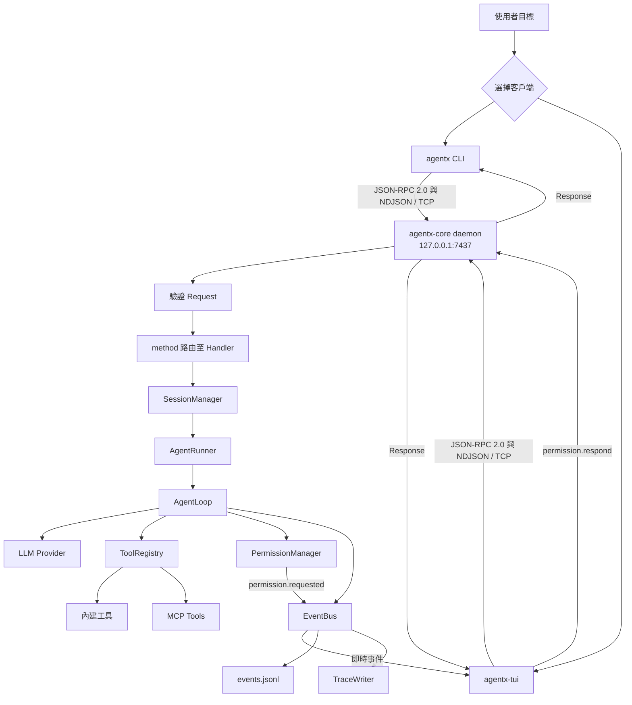

<div align="center">

# AgentX

**一套可觀察、可治理、可擴充的本地 AI Agent 執行環境。**

以 Python 實作完整 ReAct 迴圈，透過常駐 Core、CLI 與 TUI 串接工具呼叫、權限審批、事件流、長期會話、上下文壓縮、Skills、Subagents 與 MCP。


</div>

---

## 專案介紹

一般 AI Demo 通常把「接收輸入、呼叫模型、顯示答案」全部塞在同一個程式裡，難以處理長時間任務、多個客戶端、權限審批與中斷恢復。

AgentX 將真正執行任務的能力放進常駐的 `agentx-core`，CLI 與 TUI 都只是透過 TCP IPC 連線的客戶端。模型每一步的推理、工具呼叫、權限決策與 token 使用量都會成為事件，因此能即時顯示、寫入 JSONL，並在斷線後重新播放。

### 核心功能

- **ReAct Agent Loop**：支援模型思考、工具呼叫、結果回填與多步任務執行。
- **Daemon + 多客戶端**：Core 持續執行，CLI 與 TUI 可同時訂閱同一份事件流。
- **型別化 IPC**：使用 JSON-RPC 2.0 + NDJSON，命令回應與事件推送共用 TCP 連線。
- **即時 TUI**：顯示串流 token、工具呼叫、執行狀態、權限審批與上下文水位。
- **工具安全**：先驗證參數，再依策略允許、拒絕或交由使用者決定。
- **可恢復會話**：儲存 thread、notes、run events 與 trace，支援斷線重連和事件重播。
- **上下文治理**：三層 Context、工具結果截斷、手動與自動 Compact。
- **多 Agent 協作**：以 planner、executor、reviewer 子 Agent 拆分複雜任務。
- **Skills 工作流程**：用 `/review`、`/orchestrate` 等斜線命令套用固定流程與工具白名單。
- **MCP 工具擴充**：將外部 MCP Server 工具接入既有 ToolRegistry、權限與事件鏈路。

---

## 解決的問題

- **任務不中斷**：TUI 關閉或重新連線時，Core 中的任務仍可持續執行。
- **過程可追蹤**：不只顯示最後答案，也儲存每個 Run 的事件與完整 Trace。
- **工具可治理**：具有副作用的操作必須經過權限策略，避免模型直接執行危險命令。
- **長會話可續航**：系統會顯示 Context 水位，並可將歷史壓縮成可接續的交接摘要。
- **複雜任務可分工**：父 Agent 負責協調，子 Agent 依角色進行規劃、執行與審查。
- **外部能力可插拔**：MCP 工具可直接加入既有執行鏈路，不必修改 AgentLoop。

---

## 技術棧

| 元件 | 技術 | 用途 |
| --- | --- | --- |
| 執行環境 | Python 3.12、asyncio | 非同步 Daemon、Socket 與並行任務 |
| LLM | Anthropic SDK | 串流文字、Thinking Block 與 Tool Use |
| 資料模型 | Pydantic v2 | 驗證 JSON-RPC 命令、事件與工具參數 |
| 終端介面 | Textual、Rich | TUI 版面、Markdown 與即時事件顯示 |
| 通訊協議 | TCP、JSON-RPC 2.0、NDJSON | CLI、TUI 與 Core 間的雙向通訊 |
| 工具擴充 | MCP | 接入外部工具伺服器 |
| 品質工具 | pytest、Ruff、mypy | 測試、格式與嚴格型別檢查 |
| 套件管理 | uv、Hatchling | 環境同步、執行與套件建置 |

---

## 系統架構

一次任務的主要流程：



---

## 專案結構

```text
AI-Agent/
├── src/agentx/
│   ├── cli/                    # CLI 指令與輸出
│   ├── tui/                    # Textual 終端介面
│   └── core/
│       ├── agents/             # planner / executor / reviewer 設定
│       ├── bus/                # JSON-RPC 命令、事件與 envelope
│       ├── compact/            # 上下文壓縮
│       ├── events/             # EventBus 與 JSONL Writer
│       ├── llm/                # Anthropic Provider 與串流回應
│       ├── mcp/                # MCP Client、Manager 與工具包裝
│       ├── permissions/        # 權限策略、審批與持久化
│       ├── session/            # 會話、Thread、Notes 與 Run
│       ├── skills/             # 斜線命令工作流程
│       ├── subagent/           # 子 Agent 與背景任務
│       ├── tools/              # 內建工具與 ToolRegistry
│       └── transport/          # TCP Socket Client / Server
├── tests/
│   ├── unit/                   # 單元測試
│   └── integration/            # 真實程式間通訊測試
├── scripts/                    # 協議文件產生器
├── WIRE_PROTOCOL.md            # 自動產生的 IPC 協議文件
├── RUNBOOK.md                  # 維運與故障排除
├── pyproject.toml
└── Makefile
```

---

## 快速開始

### 1. 安裝環境

需要 Python 3.12 與 [uv](https://docs.astral.sh/uv/)。

```bash
git clone https://github.com/poweichen00/AI-Agent.git
cd AI-Agent
uv sync
cp .env.example .env
```

在 `.env` 填入：

```bash
ANTHROPIC_API_KEY=你的_API_Key
```

### 2. 啟動 AgentX

終端 A 啟動 Core：

```bash
uv run agentx-core
```

終端 B 啟動 TUI：

```bash
uv run agentx-tui
```

也可以用 CLI 觸發單次任務：

```bash
uv run agentx run --goal "用一句話介紹你自己"
```

---

## 使用方式

```bash
# 確認 Core 是否可連線
uv run agentx ping

# 在背景啟動、查看或停止 Core
uv run agentx core start
uv run agentx core status
uv run agentx core stop

# 開始多輪 CLI 對話
uv run agentx chat

# 查看完整 Trace，或持續追蹤新事件
uv run agentx trace
uv run agentx trace --follow

# 只查看指定 Run 或事件層
uv run agentx trace <run_id>
uv run agentx trace --layer event
```

### Skills 與 Subagents

在 TUI 輸入：

```text
/review src/agentx/core/loop.py
```

測試多 Agent 工作流程：

```text
/orchestrate 分析 src/agentx/core/runner.py 的重構風險，不要修改任何檔案
```

預期事件流程：

```text
skill.invoked
↓
planner 規劃
↓
executor 執行
↓
reviewer 審查
↓
父 Agent 彙整結果
```

---

## 品質檢查

```bash
# 單元測試
uv run pytest tests/unit -v

# 全部測試
uv run pytest

# 程式風格與靜態型別
uv run ruff check src tests scripts
uv run mypy src

# 確認 IPC 文件與模型同步
uv run python scripts/gen_protocol_doc.py --check
```

也可以執行：

```bash
make test
make lint
```

---

## 執行資料

AgentX 預設將本機狀態儲存於：

```text
~/.agentx/
├── config.toml                 # 全域設定
├── context.md                  # 全域 Context
├── policy.toml                 # 持久化權限決策
├── logs/core.log               # Core 日誌
├── traces/daemon.jsonl         # 系統 Trace
└── sessions/<session_id>/
    ├── thread.jsonl            # 對話歷史
    ├── notes.md                # Session 備註
    ├── summary_*.md            # Compact 摘要
    └── runs/<run_id>/events.jsonl
```

`.env`、API Key 與 `~/.agentx/` 都不會提交至 Git。

---

## MCP 設定範例

在 `~/.agentx/config.toml` 加入：

```toml
[[mcp.servers]]
name = "filesystem"
transport = "stdio"
command = "npx"
args = ["-y", "@modelcontextprotocol/server-filesystem", "/tmp"]
```

重新啟動 Core 後，外部工具會以 `filesystem__工具名稱` 的形式註冊，並沿用 AgentX 的工具白名單、權限審批、錯誤分類與事件顯示。

---

## 聯絡方式

**poweichen00** — [GitHub](https://github.com/poweichen00) · [專案原始碼](https://github.com/poweichen00/AI-Agent)

---

## 授權

Copyright © 2026 [poweichen00](https://github.com/poweichen00)。本專案使用 [MIT License](LICENSE)。
